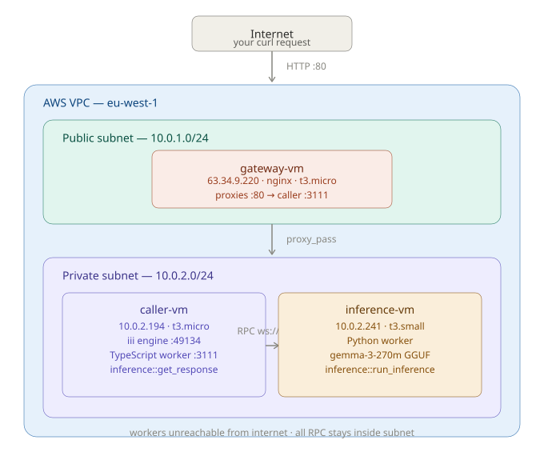

# Alchemyst AI — DevOps Internship Assignment

## Overview

This project deploys the `quickstart` distributed inference prototype across three AWS EC2 instances in a private VPC. A Python worker hosts a small language model and exposes inference over RPC. A TypeScript worker fans incoming HTTP requests into that RPC. An nginx gateway sits in front as the only public-facing endpoint.

The two workers run on separate machines, never on the same box, and communicate exclusively through the iii engine over WebSocket — not over the public internet.

## Architecture



```
                        Internet
                            │
                     HTTP :80 (public)
                            │
                    ┌───────▼────────┐
                    │  gateway-vm    │  63.34.9.220  (public subnet 10.0.1.0/24)
                    │  nginx         │  t3.micro
                    └───────┬────────┘
                            │ proxy_pass → 10.0.2.194:3111
                            │
          ┌─────────────────▼──────────────────────┐
          │           Private subnet 10.0.2.0/24    │
          │                                         │
          │  ┌──────────────────┐                   │
          │  │   caller-vm      │  10.0.2.194       │
          │  │   t3.micro       │                   │
          │  │   iii engine     │ :49134 (WS RPC)   │
          │  │   TS worker      │ :3111  (HTTP)     │
          │  └────────┬─────────┘                   │
          │           │  RPC: inference::run_inference│
          │  ┌────────▼─────────┐                   │
          │  │  inference-vm    │  10.0.2.241        │
          │  │  t3.small        │                   │
          │  │  Python worker   │                   │
          │  │  gemma-3-270m    │                   │
          │  └──────────────────┘                   │
          └─────────────────────────────────────────┘
```

Workers have no public IPs. The security group for the worker subnet allows inbound traffic only from within the VPC CIDR (`10.0.0.0/16`). Port 80 on the gateway is the only port open to the internet.

## Infrastructure

| Resource | Type | Purpose |
|---|---|---|
| VPC | 10.0.0.0/16 | Isolated network |
| Public subnet | 10.0.1.0/24 | Hosts gateway-vm |
| Private subnet | 10.0.2.0/24 | Hosts caller-vm and inference-vm |
| Internet gateway | — | Outbound internet for public subnet |
| NAT gateway | — | Lets private VMs reach internet for package installs |
| gateway-vm | t3.micro | nginx reverse proxy, public IP |
| caller-vm | t3.micro | iii engine + TypeScript caller worker |
| inference-vm | t3.small + 20GB EBS | Python inference worker, gemma-3-270m GGUF |
| Security group (gateway) | port 80 open to 0.0.0.0/0, port 22 restricted to deployer IP | Public access |
| Security group (workers) | all ports open only from 10.0.0.0/16 | Private access |

All of the above is defined in `terraform/` and can be reproduced with a single `terraform apply`.

## API

**Endpoint:** `POST /v1/chat/completions`

**Request:**
```bash
curl -X POST http://63.34.9.220/v1/chat/completions \
  -H 'Content-Type: application/json' \
  -d '{"messages": [{"role": "user", "content": "Say hello in one sentence."}]}' \
  --max-time 300
```

**Response received:**
```json
{
  "result": {
    "response": "Say hlelo in oone sence.\nThe word hlelo is used in the following contexts:\n1.\n2.\n3.\n...",
    "success": "You've connected two workers and they're interoperating seamlessly, now let's add a few more workers to expand this project's functionality."
  }
}
```

> The model output quality reflects the constraints of running gemma-3-270m (a 270M parameter model) on a CPU-only t3.small with `max_new_tokens=200`. The infrastructure chain — HTTP request → nginx → TypeScript RPC → Python inference → response — is working end-to-end. A larger model on a GPU instance would produce much better output.

## Repo structure

```
alchemyst-devops/
├── terraform/
│   ├── main.tf              # VPC, subnets, IGW, NAT gateway, route tables
│   ├── instances.tf         # EC2 instances and key pair
│   ├── security_groups.tf   # Firewall rules
│   ├── variables.tf         # Input variables
│   ├── outputs.tf           # Public/private IPs printed after apply
│   └── terraform.tfvars     # Your region, IP, key path
├── scripts/
│   ├── setup-gateway.sh     # Installs and configures nginx
│   ├── setup-caller.sh      # Installs Node.js, iii CLI, npm deps
│   ├── setup-inference.sh   # Installs Python, venv, pip deps
│   ├── iii-engine.service   # systemd unit for iii engine
│   └── inference-worker.service  # systemd unit for Python worker
├── workers/
│   ├── caller-worker/       # TypeScript worker (iii-sdk)
│   └── inference-worker/    # Python worker (transformers + gemma)
├── config.yaml              # iii engine config
├── architecture.svg         # Architecture diagram
└── README.md
```

## Redeploy from scratch

### Prerequisites

- AWS CLI configured (`aws configure`)
- Terraform >= 1.8
- SSH key pair at `~/.ssh/alchemyst-key` and `~/.ssh/alchemyst-key.pub`

### 1 — Deploy infrastructure

```bash
git clone <repo-url>
cd alchemyst-devops/terraform
terraform init
terraform apply
```

Note the output IPs:
```
gateway_public_ip    = "x.x.x.x"
caller_private_ip    = "10.0.2.x"
inference_private_ip = "10.0.2.x"
```

### 2 — Upload files to gateway

```bash
scp -i ~/.ssh/alchemyst-key -r workers scripts config.yaml ubuntu@<gateway_ip>:~/
```

### 3 — Distribute to private VMs (from inside gateway)

```bash
ssh -i ~/.ssh/alchemyst-key ubuntu@<gateway_ip>
chmod 600 ~/.ssh/alchemyst-key

scp -i ~/.ssh/alchemyst-key -r ~/workers/caller-worker ubuntu@<caller_ip>:~/caller-worker
scp -i ~/.ssh/alchemyst-key ~/scripts/setup-caller.sh ~/config.yaml ubuntu@<caller_ip>:~/

scp -i ~/.ssh/alchemyst-key -r ~/workers/inference-worker ubuntu@<inference_ip>:~/inference-worker
scp -i ~/.ssh/alchemyst-key ~/scripts/setup-inference.sh ubuntu@<inference_ip>:~/
```

### 4 — Set up caller-vm

```bash
ssh -i ~/.ssh/alchemyst-key ubuntu@<caller_ip>
bash setup-caller.sh
curl -fsSL https://install.iii.dev/iii/main/install.sh | sh
export PATH="/home/ubuntu/.local/bin:$PATH"

mkdir -p ~/quickstart/workers
cp -r ~/caller-worker ~/quickstart/workers/caller-worker
cd ~/quickstart/workers/caller-worker && npm install

# terminal 1 — start the engine
cd ~/quickstart && iii --config config.yaml

# terminal 2 — start the worker
cd ~/quickstart/workers/caller-worker
III_URL=ws://localhost:49134 node --import tsx/esm src/worker.ts
```

### 5 — Set up inference-vm

```bash
ssh -i ~/.ssh/alchemyst-key ubuntu@<inference_ip>
bash setup-inference.sh

pip install sentencepiece "numpy==1.26.4"
pip install "git+https://github.com/ggerganov/llama.cpp.git#subdirectory=gguf-py"

# patch a version-check bug in transformers 4.47 + gguf
sed -i 's/return is_available and version.parse(gguf_version) >= version.parse(min_version)/return is_available/' \
  ~/venv/lib/python3.10/site-packages/transformers/utils/import_utils.py

sed -i 's/max_new_tokens=32000/max_new_tokens=200/' ~/quickstart/workers/inference-worker/inference_worker.py
sed -i 's/return result/return {"response": result}/' ~/quickstart/workers/inference-worker/inference_worker.py

source ~/venv/bin/activate
III_URL=ws://<caller_ip>:49134 python inference_worker.py
```

### 6 — Set up gateway

```bash
ssh -i ~/.ssh/alchemyst-key ubuntu@<gateway_ip>
bash scripts/setup-gateway.sh <caller_ip>
```

### 7 — Test

```bash
curl -X POST http://<gateway_ip>/v1/chat/completions \
  -H 'Content-Type: application/json' \
  -d '{"messages": [{"role": "user", "content": "Say hello in one sentence."}]}' \
  --max-time 300
```

### Tear down

```bash
cd terraform && terraform destroy
```

## Production hardening

Things I would address before this goes anywhere near production:

**TLS** — The gateway currently serves plain HTTP. In production this would sit behind an ACM certificate with HTTPS termination at an ALB, or Let's Encrypt via Certbot on nginx directly.

**Authentication** — The `/v1/chat/completions` endpoint is open to anyone right now. At minimum this needs an API key checked at the nginx layer before the request reaches the iii engine.

**Security groups** — The worker security group currently opens all ports to the entire VPC CIDR `10.0.0.0/16`. That should be tightened to specific ports (49134 for RPC, 3111 for HTTP) from specific security group IDs only, not a CIDR range.

**Secrets** — Any credentials (HuggingFace token, future API keys) should live in AWS Secrets Manager or Parameter Store, not exported as shell environment variables.

**Process management** — The workers are currently started manually and die if the SSH session drops. The systemd unit files in `scripts/` should be installed and enabled so the engine and workers survive reboots and auto-restart on crash.

**Observability** — Add CloudWatch agent to ship logs from all three VMs to a single log group. Set alarms on inference latency and 5xx rates from nginx.

**VPC endpoints** — The inference-vm downloads the model from HuggingFace through the NAT gateway, which adds latency and cost. A VPC endpoint for S3 (for model caching) or hosting the model on S3 directly would keep that traffic inside AWS.

**IMDSv2** — Enforce IMDSv2 on all EC2 instances to protect against SSRF attacks reaching the instance metadata endpoint.

## Scaling for a larger model

If the model were 100x larger (roughly 27B parameters):

**Compute** — A 27B model in Q8 quantization needs ~27GB of memory. That means at minimum a `g5.2xlarge` (A10G, 24GB VRAM) with offloading, or more comfortably a `g5.12xlarge` (4× A10G). CPU inference at that scale would take several minutes per request — not viable.

**Serving layer** — Replace the raw `transformers.generate()` loop with vLLM or TGI. Both support continuous batching, which means multiple requests share the GPU rather than queuing one at a time. This alone gives a 5–10x throughput improvement on a single GPU.

**Storage** — A 27B Q8 model is ~27GB on disk. The root EBS volume wouldn't be enough. Attach a dedicated gp3 volume at model load time, or store the model on S3 and stream it in using the HuggingFace `from_pretrained` S3 integration.

**Auto-scaling** — Put the inference-vm behind an Auto Scaling Group. Use a custom CloudWatch metric (SQS queue depth, or a Prometheus metric from vLLM) as the scaling trigger. Scale in on idle, scale out when requests are queuing.

**Quantization** — Use 4-bit GPTQ or AWQ quantization to cut memory by ~4x. A 27B model in 4-bit fits on a single A10G with room to spare, which is far cheaper than moving to a multi-GPU instance.

**Model storage strategy** — For faster cold starts on new instances, store the quantized model as an AMI snapshot or on an EBS snapshot that gets attached on boot, rather than downloading from HuggingFace each time.
